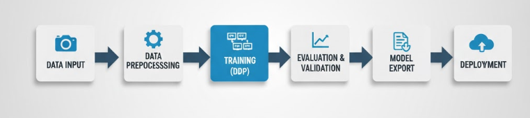

# 🦺 PPE Detection with Distributed Training  


---

## 🧠 Overview  

**PPE Detection with Distributed Training** is a research-oriented deep learning project focused on **automated detection of Personal Protective Equipment (PPE)** — including helmets, safety vests, gloves, and masks — to improve safety compliance monitoring in industrial and construction environments.  

The system utilizes **YOLOv8 segmentation models** with **Distributed Data Parallel (DDP)** training, enabling efficient multi-GPU learning for large-scale datasets.  

> ⚠️ **Confidential Notice:**  
> This repository provides **technical documentation and architecture overview** only.  
> Source code, models, and datasets are **proprietary and not publicly distributed**.

---

## ✨ Key Features  

- 🧩 **Distributed Training** – Multi-GPU acceleration with PyTorch DDP.  
- 🧠 **Custom YOLOv8 Architectures** – Enhanced with advanced attention modules (ECA, GAM, CBAM, SE, GCT).  
- ⚙️ **Dynamic Configuration System** – Modular YAML-based configurations.  
- 📊 **Robust Data Pipeline** – Integrated augmentation, preprocessing, and dataset management.  
- ⚡ **Optimized Performance** – Designed for both local GPU and HPC cluster environments.  
- 🧱 **Modular Design** – Clean separation between model, data, and training engines.  

---

## 🧩 System Overview  

The architecture follows a modular deep learning pipeline designed for high scalability and interpretability.

1. **Data Preprocessing**  
   - Automated augmentation and annotation parsing.  
   - Dataset balancing and split management.  

2. **Model Training**  
   - YOLOv8-based segmentation with integrated attention modules.  
   - Parallelized training using PyTorch Distributed Data Parallel (DDP).  

3. **Evaluation & Validation**  
   - Automated tracking of mAP, precision, recall, and segmentation quality.  
   - Validation results visualized with mask overlays.  

4. **Deployment (Internal)**  
   - Model export to **ONNX** or **TensorRT** for efficient inference.  

---

## 🏗️ Architecture  

The following diagram illustrates the overall project workflow:

```
Data Input → Preprocessing → Model Training (DDP) → Validation → Export → Deployment
```



---

## ⚙️ Technologies & Frameworks  

| Category | Tools & Frameworks |
|-----------|-------------------|
| **Programming Language** | Python 3.8+ |
| **Deep Learning Framework** | PyTorch, Ultralytics YOLOv8 |
| **Distributed Training** | PyTorch Distributed Data Parallel (DDP) |
| **Computer Vision** | OpenCV, Albumentations |
| **Configuration Management** | YAML-based modular configs |
| **Model Export & Inference** | ONNX, TensorRT |

---

## 🧠 Model Variants  

The system supports multiple **YOLOv8 segmentation variants**, incorporating advanced attention mechanisms to improve spatial and contextual feature representation:

- **ECA (Efficient Channel Attention)**  
- **GAM (Global Attention Module)**  
- **CBAM (Convolutional Block Attention Module)**  
- **SE (Squeeze-and-Excitation)**  
- **GCT (Global Context Transformer)**  

Each configuration balances **accuracy**, **speed**, and **computational cost** based on the deployment target.

---

## 🧩 Distributed Training Workflow  

The DDP training pipeline includes:  

1. **Data Sharding** – Distributes datasets evenly across all GPUs.  
2. **Gradient Synchronization** – Ensures consistent model updates.  
3. **Checkpointing & Resume** – Enables recovery from training interruptions.  
4. **Performance Monitoring** – Logs GPU utilization and training metrics.  

The workflow scales efficiently across both **local multi-GPU** setups and **multi-node HPC clusters**.

---

## 🧰 Environment Setup  

This project requires:  

- Python ≥ 3.8  
- CUDA-enabled GPU(s)  
- PyTorch with DDP support  

> 🧩 **Note:** All internal configurations, model weights, and datasets remain confidential and are not shared publicly.

---

## 📜 License & Confidentiality Notice  

> © All rights reserved.  
>  
> This repository and all related materials are **confidential and proprietary**.  
> Redistribution, modification, or public release of any part of this project is **strictly prohibited**.  
>  
> The information provided herein serves exclusively for **research documentation and reference purposes**.

---

## 👥 Authors & Contributors  

- **[Dr. Irshad Ibrahim](https://github.com/Dr-irshad)** – Research Lead  
- **[Umar Farooq](https://github.com/imumarfarooq)** – Computer Vision Researcher  

---

## 🧾 Acknowledgment  

This project contributes to ongoing research in **AI-driven safety monitoring** and **computer vision-based PPE compliance systems**, advancing real-time safety solutions through deep learning and distributed training architectures.

---
